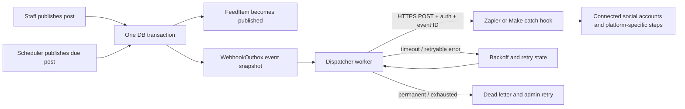

# Gemini Pro implementation prompt: reliable social publishing webhook

Copy everything between **BEGIN PROMPT** and **END PROMPT** into Gemini Pro with this Polar Portal repository open.

---

## BEGIN PROMPT

You are the implementation engineer for the existing Polar Portal repository. Implement a reliable outbound webhook integration so that a feed post that is actually published in Polar Portal can be sent to a configured Zapier or Make.com webhook. The automation platform will handle publishing to connected Instagram, X/Twitter, LinkedIn, and Facebook accounts. Polar Portal must not directly call those social network APIs or store social account credentials.

Build and verify the integration end to end: database/outbox, publishing transition, background delivery, retry/reconciliation, admin visibility/configuration, media URLs, documentation, and tests. Do not stop at a design or a button that only appears to work. Do not promise zero bugs.

### Repository rules

1. Read `AGENTS.md`, `HANDOFF.md`, `README.md`, `git status`, and the complete current diff before editing. Preserve unrelated user changes. The working tree may contain upload/status fixes; do not overwrite or revert them.
2. Before any Next.js edit, read the relevant current guide in `node_modules/next/dist/docs/` resolved from the repository root. This project's Next version may have breaking changes.
3. Inspect the actual feed models, transitions, scheduled publishing worker, storage/media handling, settings, migrations, frontend admin UX, API proxy, Docker/deployment configuration, and existing tests. The known paths below are starting points, not assumptions; verify the current code.
4. Use the existing FastAPI/SQLAlchemy/Alembic/PostgreSQL/SQLite/Redis/RQ architecture. Add deployed schema changes through Alembic. Do not add a social network SDK or paid service. Do not use user-provided webhook URLs; destination URL is server configuration only.
5. Do not commit. Do not change unrelated behavior or secrets.

### Verified architecture to re-check

- `backend/app/modules/feed.py` defines `FeedItem`, media associations, JSON serialization, and `POST /api/feed/items/{item_id}/transition`.
- Feed lifecycle includes `draft -> in_review -> approved -> published`, and scheduled publishing is handled from `backend/app/worker.py` (`scheduler_tick`).
- The webhook should trigger only when the item becomes **published**: on explicit `publish`, or when a scheduled item actually reaches its publish time. **Approval alone must not publish externally.** The scheduled path is essential; do not wire only the HTTP transition.
- Feed items reference media through `primary_asset_id` and related media rows; underlying files live in local/S3-compatible storage. Inspect what can be fetched from outside the deployment. Never send internal object keys or assume RustFS is internet-accessible.
- Redis/RQ is part of the current stack, but a durable database outbox is the source of truth for webhook events. Queue messages may wake the dispatcher; losing a queue message must not lose an event.

### Target architecture



#### Transactional outbox and event lifecycle

- Create an Alembic migration for a durable outbound event/outbox table. A row should hold a generated event ID, event type, feed item ID, immutable payload snapshot (or enough immutable data to construct it), state, attempt count, next-attempt time, last HTTP status/error summary, created/sent timestamps, and optional response ID. Index fields used by the worker. Add a uniqueness/idempotency constraint that guarantees one publish event per feed item publication occurrence.
- Create the outbox event in the **same database transaction** that changes `FeedItem.status` to `published`. No network call inside the publishing transaction. A database failure must roll back both publication and event creation.
- Use one shared service function for explicit and scheduled publication. The manual transition endpoint and scheduler must call that service so neither path can skip event creation. Do not fire on `approve`, `schedule`, `in_review`, `request_changes`, `reject`, `unpublish`, or `archive`.
- Store a snapshot at publication time so edits/retries cannot silently change what content the automation receives. Include an event schema version.
- Event states should be explicit, for example `pending`, `sending`, `retry_wait`, `delivered`, and `dead_letter`. Add bounded attempts and exponential backoff with jitter; honor `Retry-After` for 429/temporary responses where possible. Treat network errors and 5xx as retryable; classify other 4xx as permanent unless a specific response is known to be transient. Store sanitized error summaries; never store response secrets or log full authorization headers.
- Make dispatch concurrency safe. Use row locks/`SKIP LOCKED` on PostgreSQL if supported and a safe SQLite-compatible fallback. Prevent two workers from sending the same pending event concurrently. Recover stale `sending` rows after a process crash.
- Delivery is **at least once**, because a timeout can happen after Zapier/Make accepted the request. Include a stable `event_id` / idempotency key and document downstream deduplication. Do not claim mathematically guaranteed exactly-once social posting. Admins must be able to inspect ambiguous/retried/dead-letter events and retry safely; manual retry must reuse the same event ID and payload.
- A scheduled post creates its event only when the scheduler commits the transition to `published`. Re-running the scheduler must not create duplicates.

#### Webhook security and configuration

- Add backend settings such as `SOCIAL_WEBHOOK_ENABLED`, `SOCIAL_WEBHOOK_URL`, a high-entropy shared secret, connect/read timeout, max attempts, and backoff bounds. The secret and URL must be server-only; never return them in public APIs, frontend bundles, logs, or error messages. Update `.env.example`, Compose/Render documentation, and operations instructions without real secrets.
- The configured URL must be HTTPS in production. Validate it at startup/configuration and fail closed if the integration is enabled with a missing/invalid URL or secret. Never accept a per-request callback URL, which would create SSRF risk. Do not follow redirects to an unvalidated host; preferably disable redirects.
- Send a secret authentication header (for example `Authorization: Bearer ...`) over HTTPS. If the chosen Make/Zapier trigger cannot use a custom auth header, document a secure alternative such as an unguessable dedicated webhook URL plus edge filtering; do not put shared secrets in the payload or query string. Consider HMAC signing with timestamp and event ID if the target workflow can validate it.
- Use strict timeouts and bounded payload size. Redact credentials from exception text and logs. A network outage must not block staff publication or hold a DB transaction open.
- Add an admin-only health/test action that sends a clearly marked test event or verifies safe connectivity without publishing a real feed item. Do not expose the configured URL/secret in the response. Audit or rate-limit manual retries/test sends.

#### Payload contract

Document and version a stable JSON schema. Example:

```json
{
  "schema_version": 1,
  "event_id": "stable-uuid",
  "event_type": "polar.feed_item.published",
  "published_at": "ISO-8601 UTC timestamp",
  "portal_url": "https://portal.example/feed/item/123",
  "post": {
    "id": 123,
    "kind": "post",
    "title": "Example title",
    "text": "Caption text",
    "hashtags": ["polar", "science"],
    "media": [
      {"kind": "image", "url": "https://portal.example/api/public/feed/123/media/456", "alt_text": "..."}
    ]
  }
}
```

- Build payload fields from the persisted published `FeedItem` and associated media. Keep it platform-neutral; let Zapier/Make map/transform caption lengths, hashtags, image/video format, and platform-specific fields.
- Do not include internal storage keys, private review comments, account details, bearer tokens, or unpublished content. Do not invent an image URL from a storage key.
- Provide stable public media URLs that a social platform can fetch without portal cookies. Add a narrowly scoped media route if necessary; it must verify the parent feed item is `published` and the requested file is actually attached to that item. Return correct content type, safe caching, and byte-range behavior for video if needed. Use existing approved/ready asset checks. Keep private/draft media inaccessible. Avoid an endpoint that streams arbitrary storage keys.
- Prefer an immutable/public permalink or stable media route over expiring URLs, because social platforms may fetch media after webhook delivery. If deployment requires signed object URLs, configure lifetime accordingly and test platform fetch timing. `PUBLIC_APP_URL` must be configured to the externally reachable HTTPS portal origin; never hardcode localhost.
- If media is an external URL, pass only a validated HTTPS URL and do not have the backend fetch it. Document that external platforms must be able to reach it.

#### Admin UX and operations

- Extend the existing staff feed/reel publishing UI rather than creating a duplicate publishing product. Show whether outbound publishing is enabled and show per-event delivery state: pending, retrying, delivered, or needs attention. Show last attempt/time and a safe error summary. Never show secrets.
- Provide role-guarded actions to retry a dead-letter event and, if appropriate, disable/enable the integration through server config. Do not allow editors to change the endpoint URL or secret from an unvalidated public form. Follow existing `admin`/`editor`/`reviewer` authorization patterns.
- Clearly distinguish “approved” (internal approval) from “published to portal / sent to automation.” Explain that successful webhook delivery means Zapier/Make accepted the event, not that every social network published successfully. If practical, document how to pass platform action outcomes back to Polar Portal; do not fabricate delivery confirmation absent a callback.
- Add a setup guide: create Zapier Catch Hook or Make Custom Webhook; configure its URL/secret on the server; map `post.text`, `post.media[].url`, `post.hashtags`, and `portal_url`; connect each social account in Zapier/Make; test with a test event; turn the automation on. Mention that platform features, account eligibility, formats, and service limits are controlled by Zapier/Make and the social platform, not this backend.
- Define behavior for `unpublish`: do not silently delete already-published external posts. Either send a separate `polar.feed_item.unpublished` notification event for a human-configured automation or document that external posts remain until removed through the automation/platform.

### Implementation workflow

1. **Audit (read-only):** document exact manual and scheduled publish paths, current media URL behavior, worker topology, migration head, existing UI/admin permissions, and current tests. Identify integration gaps.
2. **Domain and persistence:** define event schema and uniqueness semantics; implement migration and publication/outbox service. Keep status transitions and event creation atomic.
3. **Dispatcher:** implement configurable HTTP sender, safe headers, retries/backoff, stale-send recovery, and worker integration. Network work must occur outside request/database transactions.
4. **Media and payload:** implement/secure stable public media routes and construct immutable payloads. Verify draft/private assets cannot leak.
5. **Admin UX and docs:** show delivery state/actions using existing patterns; add `.env.example`, local/dev and deployment setup, and Zapier/Make mapping guide.
6. **Verification:** add focused tests, run relevant tests/lint/type checks, rehearse migration, inspect complete diff, and report actual results and limitations.

Finish each milestone before moving on. Preserve existing user changes. Do not ask for provider preference: Zapier and Make are both supported by a generic HTTPS webhook and can be selected by deployment configuration. Ask only if an actual product decision blocks safe behavior.

### Acceptance criteria

- Publishing an approved feed item manually creates exactly one durable outbox event in the same transaction as the `published` status transition.
- An approved-only, scheduled, drafted, rejected, archived, or unpublished item never creates a publish event. A due scheduled post creates one event when it becomes published.
- Webhook delivery is asynchronous, bounded, retryable after restart, concurrency-safe, and has visible dead-letter/retry operations.
- Timeouts/429/5xx/permanent 4xx are classified and handled as documented. Retrying does not change payload or idempotency key. Ambiguous timeouts are explicitly treated as potential duplicate risk.
- Payload contains text/title/hashtags, post URL, and working externally fetchable image/video URLs; never internal object keys or private content.
- Media routes reject unpublished feed items, detached media IDs, unapproved/unready assets, and arbitrary storage keys.
- A test event is distinguishable from a real publication and does not mutate a feed item.
- Webhook URL and credentials remain server-side; production requires HTTPS; no arbitrary destination can be supplied by API callers.
- Portal publication succeeds even if webhook is unavailable; event remains retryable and UI communicates the delivery state accurately.
- The docs describe configuring Zapier/Make and clarify that external-platform success is controlled by the automation and their connected accounts.

### Focused tests

Add backend tests for:

- explicit publish creates one outbox row atomically; repeated requests/state changes do not duplicate;
- approval does not dispatch; scheduled scheduler path dispatches once;
- outbox payload snapshot is immutable;
- sender headers/auth, timeout, 2xx success, 429/5xx retry schedule, permanent 4xx, redacted errors, max attempts/dead-letter;
- concurrent workers/stale `sending` recovery and manual retry event identity;
- media URL generation and access checks for public published media vs draft/private/detached/arbitrary key;
- webhook outage does not roll back portal publication;
- API/admin permissions prevent unauthorized inspection/retry/configuration;
- migration upgrades supported Postgres/SQLite schema without affecting existing posts.

Run targeted backend tests and the project's relevant full check suite. Run frontend lint/build/type checks if UI changes. Do not claim checks passed unless actually run. If Redis or external webhook credentials are unavailable, use a local mock HTTP server for delivery tests and clearly state live Zapier/Make publishing could not be verified.

### Final report

Report: existing publishing paths found; architecture/schema decisions; files/migration/config changed; precise environment variables and Zapier/Make setup; exact commands and results; known delivery semantics (at-least-once and duplicate risk after ambiguous timeout); and any external setup still required. Do not claim a post reached Instagram/X/LinkedIn/Facebook unless the connected automation confirms it.

## END PROMPT
