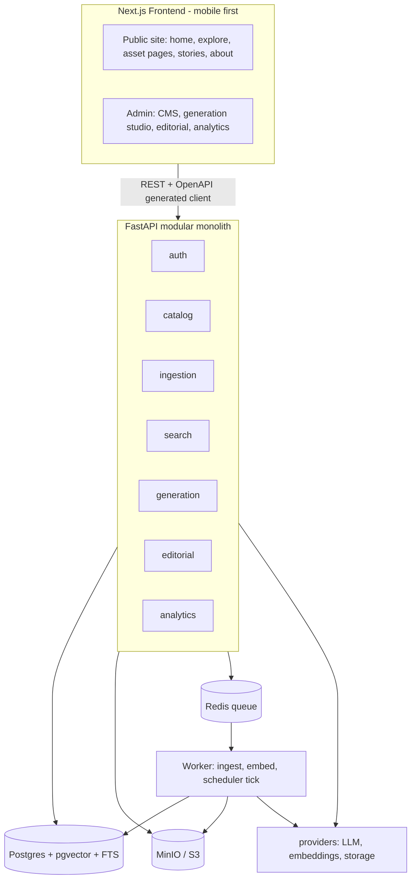
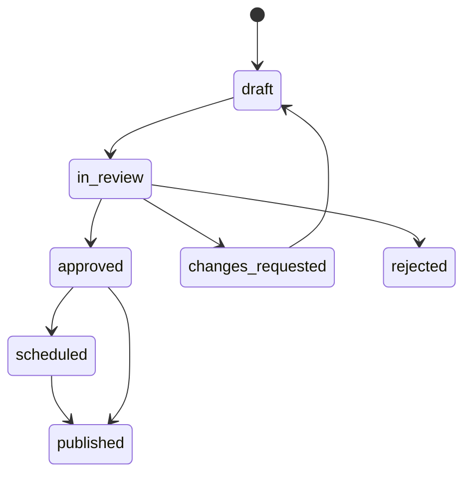
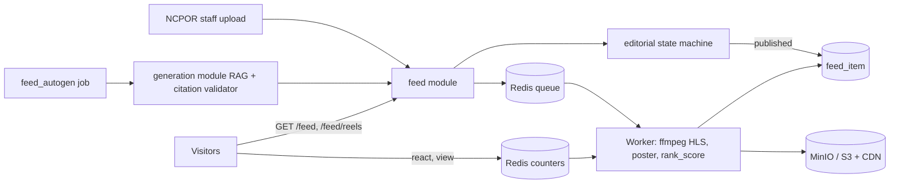

# Polar Portal: System Architecture

**Project:** Integrated Polar Science Outreach, Knowledge Repository & Media Dissemination Portal (NCPOR / MoES)
**Build window:** 24 hours, several contributors, possibly different LLM coding assistants
**Goal:** every person owns one slice, nobody edits anyone else's files, and features can be added or changed quickly later.

---

## 1. Core decision: modular monolith with hard contracts

No microservices in a one-day build (network glue, inter-service auth and deployment would eat the time). We build:

- **One FastAPI backend** split into independent modules
- **One worker process** (background jobs, scheduler)
- **One Next.js frontend** (mobile-first)

Modules talk **only** through interfaces in `contracts/`. Any module can later be split into its own service without a rewrite.



### Tech stack

| Concern | Choice | Why |
|---|---|---|
| API | FastAPI, SQLAlchemy, Alembic | Auto OpenAPI docs, so frontend and backend need not coordinate manually |
| Database | Postgres + pgvector + full-text search | One DB does keyword, vector and metadata filters |
| Files | MinIO (S3 API) | Same code works on AWS S3 |
| Jobs | Redis + RQ | Retries and failed-job tracking built in |
| Text embeddings | bge-small-en / multilingual-e5-small | Local, CPU friendly (384 dims) |
| Image search | CLIP ViT-B-32 | Text-to-image without relying on filenames (512 dims) |
| LLM | LiteLLM behind `LLMProvider` | Swap Claude, GPT, Ollama or vLLM via config |
| Frontend | Next.js, Tailwind, shadcn/ui | Mobile-first utilities, SSR for public pages |
| Deploy | docker-compose | `docker compose up` runs everything |

---

## 2. Repository layout (one owner per folder)

```
polar-portal/
├── contracts/                  # FROZEN at hour 2
│   ├── schemas.py              # Pydantic: Asset, Chunk, SearchHit, Draft, Citation
│   ├── interfaces.py           # Protocols: LLMProvider, Embedder, Storage, Extractor
│   ├── events.py               # job names + payloads
│   └── statuses.py             # draft state machine, roles
├── backend/app/
│   ├── core/                   # config, db session, rbac, logging
│   ├── providers/              # llm/, embeddings/, storage/
│   ├── modules/
│   │   ├── auth/               # Track A
│   │   ├── catalog/            # Track A
│   │   ├── ingestion/          # Track B
│   │   ├── search/             # Track C
│   │   ├── generation/         # Track D
│   │   ├── editorial/          # Track E
│   │   └── analytics/          # Track E
│   ├── worker.py               # registers jobs from modules
│   └── main.py                 # auto-mounts modules/*/router.py
├── web/src/
│   ├── lib/api/                # generated client, never hand-edited
│   ├── components/ui/          # shared: AssetCard, FilterSheet, Gallery, Pagination
│   └── features/
│       ├── explore/            # Track C-FE
│       ├── assets/             # Track B-FE
│       ├── stories/            # Track E-FE
│       ├── admin-content/      # Track A-FE
│       ├── admin-generate/     # Track D-FE
│       └── admin-editorial/    # Track E-FE
├── infra/                      # docker-compose.yml, Dockerfiles, .env.example
├── docs/                       # one MODULE.md per module
└── CODEOWNERS
```

Each backend module contains exactly: `router.py` (HTTP), `service.py` (functions other modules may call), `models.py` (its tables), optional `jobs.py`.

### Anti-overlap rules

1. A module's tables are written **only** by that module. Others read via its `service.py`, never by importing its models.
2. `main.py` auto-discovers `modules/*/router.py`, so nobody edits a shared router file.
3. Alembic migrations are prefixed per track (`a_001_users`, `b_001_chunks`) to avoid multi-head conflicts.
4. Cross-module reactions use **events** (e.g. `asset.ingested`), not imports.
5. Changes to `contracts/` need a message in the team chat first.
6. Each person works on their own branch (`track-a` ... `track-e`), merged to `main` every 2 to 3 hours.

---

## 3. Data model

```
expedition(id, name, year, region, stations[], description)
asset(id, type[report|dataset|publication|photo|video|activity], title, description,
      expedition_id NULL=general, region, year, file_key, thumb_key, external_url,
      status[processing|ready|failed], error, version, created_by, updated_at)
asset_version(id, asset_id, version, snapshot_json, created_at)
tag(id, name, kind[theme|station|region])      asset_tag(asset_id, tag_id)
chunk(id, asset_id, idx, text, page, embedding vector(384), tsv tsvector)
image_embedding(asset_id, embedding vector(512))
draft(id, kind[article|twitter|instagram|facebook], title, body_md, tone, status,
      expedition_id, scheduled_at, published_at, created_by, reviewer_id)
draft_citation(id, draft_id, claim_text, chunk_id, asset_id, span_text, supported bool)
draft_comment(id, draft_id, author_id, body, action[comment|changes|approve|reject])
user(id, email, password_hash, role[admin|editor|reviewer|viewer])
search_log(id, query, filters_json, n_results, ts)
view_log(asset_id, ts)
config(key, value_json)     # LLM params, ranking weights, embedding model, taxonomies
```

Indexes: GIN on `chunk.tsv`, HNSW on both embedding columns, btree on `asset(type, expedition_id, year, region)`.

---

## 4. Shared interfaces (this is what lets people swap LLMs and work in parallel)

```python
class LLMProvider(Protocol):
    def generate(self, system: str, prompt: str, *, temperature: float,
                 max_tokens: int, json_schema: dict | None = None) -> str: ...

class Embedder(Protocol):
    def embed_texts(self, texts: list[str]) -> list[list[float]]: ...
    def embed_image(self, data: bytes) -> list[float]: ...
    def embed_query_for_images(self, text: str) -> list[float]: ...

class Storage(Protocol):
    def put(self, key: str, data: bytes, content_type: str) -> None: ...
    def url(self, key: str, expires: int = 3600) -> str: ...

class Extractor(Protocol):            # one class per file type
    def extract(self, file_path: str) -> ExtractedDoc: ...   # text, pages, raw_meta
```

Provider choice lives in `.env` / `config` table (`LLM_PROVIDER=anthropic|openai|ollama`). Track D builds against a **FakeLLM** returning canned JSON until the real provider is wired. Same trick for embeddings (random vectors) so search can be built early.

---

## 5. Module specifications

### Track A: Auth, Catalog, Admin CMS
- JWT login (email + password). `require_role("editor")` dependency in `core/rbac.py`.
- CRUD: expeditions, assets (all 6 types), tags, taxonomies, users, config.
- Every update writes an `asset_version` snapshot and increments `version`.
- Optional: bulk CSV metadata import.
- **Endpoints:** `/auth/login`, `/expeditions`, `/assets`, `/tags`, `/users`, `/config`

### Track B: Ingestion pipeline
`POST /ingest/upload` validates extension, MIME sniff and size limit, stores the raw file in MinIO, creates the asset as `processing`, and enqueues `ingest_asset`.

Job steps:
1. Pick an `Extractor`: PDF (PyMuPDF), DOCX (python-docx), CSV (pandas), NetCDF (xarray, header and variables only), photo (EXIF + Pillow thumbnail).
2. Guess metadata (title, authors, year, location) by regex, optionally a cheap LLM call. Admin can edit afterwards.
3. Chunk text (about 500 tokens, 50 overlap), embed, store with `tsvector`.
4. Images: compute CLIP embedding.
5. Mark `ready` or `failed` with the error. RQ retries 3 times with backoff. Failed jobs appear in an admin list with a retry button.

New file format later = add one Extractor class and register it.

### Track C: Search
`GET /search?q=&type=&expedition=&year_from=&year_to=&region=&tags=&sort=&page=`

**Hybrid ranking** (weights live in `config`):

```
score = w_kw * norm(ts_rank) + w_sem * (1 - cosine_distance) + w_rec * recency
defaults: w_kw = 0.4, w_sem = 0.5, w_rec = 0.1
```

Worked example: report X has normalized keyword 0.8, cosine similarity 0.75, recency 0.9, so score = 0.32 + 0.375 + 0.09 = **0.785**. Report Y has no keyword match, similarity 0.85, recency 0.5, so score = 0 + 0.425 + 0.05 = **0.475**. Y still appears, just lower. That is why hybrid beats either method alone.

Flow: keyword top-50 plus vector top-50 (filters applied in SQL), merge by asset, apply formula, sort, paginate.

- `GET /search/images?q=penguin colonies at Maitri` uses the CLIP text embedding against `image_embedding`.
- Natural-language ranges ("between 2015 and 2020") are parsed into `year_from`/`year_to` before searching.
- Every query is written to `search_log`.
- Results are cards: title, type, expedition, snippet or thumbnail.

### Track D: AI generation (grounded, with citation discipline)
`POST /generate` takes `{asset_ids | expedition_id | theme, formats[], tone}`.

1. **Retrieve** chunks only from selected assets (or via search for a theme). Label them `C1..Cn`.
2. **Prompt** with only those chunks and asset metadata. Require JSON:
   ```json
   {"title": "...", "sections": [{"heading": "Intro", "paragraphs": [
     {"text": "...", "citations": [{"chunk_id": "C12", "span": "exact quote from chunk"}]}]}]}
   ```
3. **Validate** (`citation_validator.py`): each `chunk_id` must be in the retrieved set, and each `span` must appear in that chunk (whitespace-normalized, fuzzy threshold about 0.9). Failed paragraphs are retried once with the error, then flagged `supported=false` and shown to the editor. They are never silently accepted.
4. **Shape checks:** article 400 to 800 words (intro, key findings, human angle, conclusion). Twitter thread 2 to 5 tweets. Instagram caption with hashtags. Facebook post. Each social variant states expedition name, year, one key fact, and a source line like "Source: 24th Indian Antarctic Expedition Report".
5. **Tone** parameter: general public, school students, technical.
6. Save as `draft` (status `draft`) with `draft_citation` rows. The studio UI highlights the source snippet beside each claim, linked to the original asset.

### Track E: Editorial, scheduling, publishing, analytics



- One function `transition(draft, action, user)` enforces all rules and role checks.
- Comments, change requests, approvals and rejections stored in `draft_comment`.
- **Scheduler:** worker ticks every 60 s, publishes `scheduled` drafts where `scheduled_at <= now()`. Store UTC, display IST (`Asia/Kolkata`).
- `GET /editorial/calendar?month=` for the calendar view.
- Publishing an article exposes it at public `/stories`. Social posts get a mock preview panel (X, Instagram, Facebook components).
- **Analytics:** top search terms (`GROUP BY query`), most viewed assets, stories published per month.

---

## 6. Frontend: mobile-first rules

Public viewers will mostly be on phones, so:

- Tailwind defaults are the **phone layout**. Add `md:` and `lg:` for larger screens. Never design desktop first.
- **Explore:** filters in a bottom sheet on mobile, sidebar on desktop. Cards are 1 column, then 2 to 3 on larger screens.
- **Photo page:** swipe gallery. **Report page:** on small screens show extracted text plus a download button (embedded PDFs behave badly on phones).
- `next/image` with responsive sizes and lazy loading. Touch targets at least 44 px. Viewport meta set.
- Video: responsive 16:9 wrapper. Article body: readable line length, images full-width.
- Admin screens may be desktop-first.
- Shared components in `components/ui` and shared design tokens (colors, fonts, spacing) agreed in hour 1 keep all tracks looking consistent.

### Pages
| Page | Route | Owner |
|---|---|---|
| Home (intro, featured, CTA) | `/` | Track E-FE |
| Explore | `/explore` | Track C-FE |
| Asset detail (report / photo / video / dataset) | `/assets/[id]` | Track B-FE |
| Stories list and article | `/stories`, `/stories/[slug]` | Track E-FE |
| About (NCPOR, Maitri, Bharati, Himadri, Himansh, official links) | `/about` | Track E-FE |
| Admin content, upload | `/admin/content` | Track A-FE |
| Generation studio | `/admin/generate` | Track D-FE |
| Drafts, review, calendar | `/admin/editorial` | Track E-FE |

---

## 7. Working with different LLMs without collisions

Give each person's assistant this prompt structure:
1. Paste the entire `contracts/` folder.
2. Paste their module's `docs/MODULE.md`.
3. Add: *"Only create or edit files inside `backend/app/modules/<yours>/` and `web/src/features/<yours>/`. Do not modify anything else. If you need a change elsewhere, tell me instead of making it."*

Depend on **stubs**, not on teammates: Track C seeds fake chunks, Track D uses canned chunks and FakeLLM, frontend tracks use the generated OpenAPI mock data.

---

## 8. Non-functional requirements

| Area | Approach |
|---|---|
| Security | RBAC on every admin route, file type allowlist and size limit, parameterized queries, CORS locked to web origin, login rate limit, sanitized Markdown rendering |
| Performance | HNSW and GIN indexes, top-50 candidate merge, pagination, thumbnails, target under 1 to 2 s search |
| Scalability | API and workers stateless: `docker compose --scale worker=N` or K8s replicas. Postgres read replicas. If search outgrows Postgres, replace only the `search` module backend (OpenSearch or Qdrant) |
| Reliability | RQ retries with backoff, failed-job list and retry button, ingestion status on each asset |
| Observability | JSON logs with request ID, `/health`, `/metrics` (requests/sec, queue length), job logs |
| Deployment | Docker + docker-compose (api, worker, web, postgres, redis, minio), GitHub Actions ready |

---

## 9. Timeline (24 hours)

| Hours | Work | Outcome |
|---|---|---|
| 0 to 2 | **Everyone together:** freeze `contracts/`, DB schema, docker-compose, design tokens, `.env` | Skeleton runs with one command |
| 2 to 8 | Tracks A to E build against stubs | Upload, extract, store works. Search returns rows. Generation returns JSON |
| 8 to 10 | **Integration 1:** merge, fix contract mismatches | End-to-end ingest to search |
| 10 to 16 | Wire frontends to real APIs, validator, scheduler, calendar | Generate, review, publish journey works |
| 16 to 20 | Image search, seed demo data (10 to 15 reports, 30 photos), test on a real phone | Demo ready |
| 20 to 24 | Bug fixing, README, diagram, demo script, backup screen recording | Submit |

### If behind, cut in this order
Bulk CSV import, NetCDF beyond headers, analytics charts (keep tables), OAuth (keep email + password), technical-audience tone, advanced reranking.

**Never cut:** ingestion, hybrid search, grounded generation with citation validation, review/approve/schedule, public Stories page.

---

## 10. Example journeys (acceptance tests)

1. **Ingest, search, read:** admin uploads an Antarctic report + photos, system extracts text, metadata and embeddings, public user searches "Maitri winterover" and opens the report and photos.
2. **Generate, review, publish:** editor picks an expedition + 2 reports + 3 photos, system generates 1 article + 1 Twitter thread + 1 Instagram caption, editor edits, approves, schedules for next week, and at the scheduled time the article appears on `/stories`.
3. **Semantic image search:** query "penguin colonies" returns relevant photos across expeditions even when filenames do not contain "penguin".

---

# ADDENDUM: Discover Feed (Instagram-style posts and reels) - Track F

**Requirement:** normal visitors browse a classic informational site (like ncpor.res.in: About, Research, Stations, Activities, Publications, Notices) **plus** a "Discover" area where they scroll posts and vertical reels like Instagram. Visitors can only **consume and react**. Only NCPOR staff can create content, or the system generates it autonomously under guardrails.

## 11. Design principles

1. **A feed item is a presentation wrapper, not new content.** It points at existing `asset` / `draft` rows, so archive, stories and feed never duplicate data.
2. **Read-only public.** The only public writes are anonymous reactions and view pings (rate limited). No public accounts in v1.
3. **One publishing pipeline.** Staff posts and auto-generated posts go through the same status machine as stories (`draft, in_review, approved, scheduled, published`). Autonomy is a config setting, not a separate path.
4. **Feed is a new module.** It adds one backend module, one frontend feature and a few contract entries. Nothing existing changes.

## 12. Roles and permissions

| Action | Public (anonymous) | Viewer | Editor | Reviewer | Admin |
|---|---|---|---|---|---|
| Browse site, scroll feed and reels | yes | yes | yes | yes | yes |
| Like, save (local), share | yes | yes | yes | yes | yes |
| Create or upload posts and reels | no | no | yes | no | yes |
| Approve or reject feed items | no | no | no | yes | yes |
| Configure autogen, kill switch, ranking | no | no | no | no | yes |
| Comments | phase 2 (needs login + moderation) | | | | |

## 13. Architecture additions



## 14. Data model additions (owned by Track F, migration prefix `f_`)

```
feed_item(id, kind[post|carousel|reel], caption, hashtags[], expedition_id NULL,
          primary_asset_id, poster_key, hls_key, mp4_key, duration_s, aspect,
          source[staff|auto], origin_draft_id NULL, status, scheduled_at, published_at,
          editorial_boost float default 0, rank_score float, like_count, view_count,
          share_count, ai_assisted bool, created_by)
feed_item_media(item_id, idx, asset_id, kind[image|video], alt_text)
feed_reaction(item_id, anon_id, type[like|share], ts)   UNIQUE(item_id, anon_id, type)
feed_view(item_id, anon_id, watch_ms, ts)
autogen_rule(id, name, trigger[on_ingest|daily|anniversary], template, enabled,
             auto_publish bool, max_per_day)
```

Indexes: `(status, rank_score DESC, id)` for the feed query, `(status, kind, published_at DESC)` for reels.

`draft_citation` is reused, so every auto-generated caption keeps its source spans.

## 15. API (all under `/feed`)

| Endpoint | Who | Notes |
|---|---|---|
| `GET /feed?cursor=&tab=for_you\|latest&expedition=&tag=` | public | published posts, cursor pagination |
| `GET /feed/reels?cursor=` | public | only `kind=reel`, vertical player order |
| `GET /feed/{id}` | public | deep link, share page with OG tags |
| `POST /feed/{id}/react` | public | `{type}`, anon cookie, rate limited (e.g. 30/min per IP) |
| `POST /feed/{id}/view` | public | `{watch_ms}` batched from client |
| `POST /feed/items` , `PATCH /feed/items/{id}` | editor | create or edit, media upload via ingestion |
| `POST /feed/items/{id}/transition` | reviewer/admin | reuses `editorial.transition()` |
| `GET/PUT /feed/autogen/rules` | admin | enable rules, kill switch |

**Why cursor, not page numbers:** new posts arrive while someone scrolls. With page=2 offset pagination, a new post pushes item 20 into page 2 and the user sees it twice. A cursor `(rank_score, id)` of the last item seen says "give me the next 10 below this", so nothing repeats or is skipped.

## 16. Feed ranking (worker recomputes every 5 minutes into `rank_score`)

```
rank_score = 0.5 * recency + 0.3 * engagement + 0.2 * editorial_boost
recency    = 0.5 ^ (age_days / half_life_days)        default half_life = 3
engagement = (likes + 2*shares) / max(views, 20)      capped at 1.0
```

Worked example: a post is 2 days old, has 30 likes, 5 shares, 100 views, and staff pinned it with boost 1.0.
- recency = 0.5^(2/3) = 0.63
- engagement = (30 + 10) / 100 = 0.40
- score = 0.5*0.63 + 0.3*0.40 + 0.2*1.0 = 0.315 + 0.12 + 0.2 = **0.635**

A fresh post with no engagement and no boost (age 0): 0.5*1 + 0 + 0 = 0.5, so it still surfaces near the top and can rise or fall from there. Weights and half-life live in `config`. Pre-computing `rank_score` keeps the feed query a simple indexed sort (fast, cacheable).

## 17. Reel and media pipeline

1. Staff uploads MP4 (max e.g. 200 MB, 90 s) through `ingestion`, status `processing`.
2. Worker with ffmpeg: transcode to vertical 9:16 (720x1280 and 360x640), package as **HLS**, extract a poster frame, optional auto captions.
3. Store segments in MinIO/S3, serve through a CDN (Cloudflare or CloudFront) so video never loads through the API.
4. Photos and carousels: generate 3 sizes (400, 800, 1600 px) plus blur placeholder.
5. Retries and failed states use the same RQ mechanism as other ingestion jobs.

**Fallback if short on time:** skip HLS and serve a single transcoded MP4 with `<video preload="metadata">`.

## 18. Autonomous content (`modules/feed_autogen/`, Track D)

| Trigger | Output |
|---|---|
| `asset.ingested` (new photo or report) | Photo post with caption and 1 key fact from the report |
| Daily job | "Did you know?" post from a random ready report |
| Expedition anniversary | "On this day, Nth expedition" carousel |
| Stretch goal | Slideshow reel: photos + captions + Ken Burns effect via ffmpeg |

**Guardrails (non-negotiable):**
- Reuses the generation module, so retrieval-only context and the **citation validator** must pass before anything is saved.
- Every auto item shows a "Source: ..." footer and an **AI-assisted** badge (`ai_assisted=true`).
- Default is `status=in_review`. Only rules with `auto_publish=true` skip review, and only when validator passes fully.
- Admin **kill switch** and per-rule `max_per_day` cap.
- Deduplicate: no two auto posts from the same asset within 30 days.

## 19. Frontend additions (`web/src/features/feed/`, mobile-first)

- **Navigation:** mobile bottom tab bar: Home | Discover | Explore | Stories | About. Desktop uses a top nav. Classic pages stay text-and-document oriented like ncpor.res.in. Discover is the social layer.
- **Discover page:** single column post cards (image or carousel with swipe dots, caption with "more", hashtags, like and share bar, source line). Infinite scroll via `IntersectionObserver` plus cursor API.
- **Reels viewer:** full-screen vertical using CSS `scroll-snap-type: y mandatory`, one video per screen. Rules: only the visible video plays (muted autoplay, tap to unmute), preload the next one only, pause on tab hide. Desktop shows a centered 9:16 column.
- **Components:** `FeedPage`, `PostCard`, `Carousel`, `ReelsViewer`, `ReelPlayer` (hls.js), `ReactionBar`, `ShareSheet` (Web Share API with copy-link fallback).
- **Admin:** `admin-feed/` with composer (upload media, caption, hashtags, expedition, schedule), review queue, autogen rules page, live phone-frame preview.
- Likes are optimistic in the UI and sent in the background. Saves live in `localStorage` (no account needed).
- Reduce data use: respect `prefers-reduced-motion`, no autoplay on data-saver mode.

## 20. Security, scale and ownership

- **Security:** public endpoints only accept `react` and `view` (rate limited, anon cookie, no personal data). Media served through signed or CDN URLs. Captions rendered as sanitized text. Creating or editing feed items requires `editor` role.
- **Scale:** Redis caches the first feed page for 60 s. Like and view counters are incremented in Redis and flushed to Postgres by the worker every minute. HLS files are static on the CDN.
- **Ownership:** `modules/feed/` and `web/src/features/feed/` = **Track F**. `modules/feed_autogen/` = **Track D** (already owns generation). `admin-feed` UI = Track F. Contracts to freeze now: `FeedItem`, `FeedKind`, event `feed.item_created`, event `asset.ingested` payload.
- **Timeline impact:** add about 6 to 8 hours of one person's time. Build order: post cards + image feed, then carousel, then reels, then autogen. If behind, ship image posts and carousels with staff creation only, then add reels and autogen.
